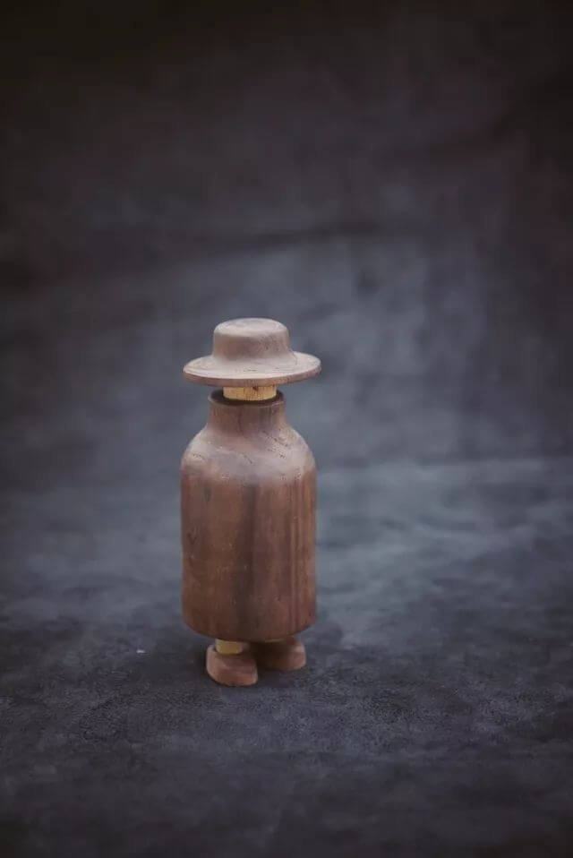
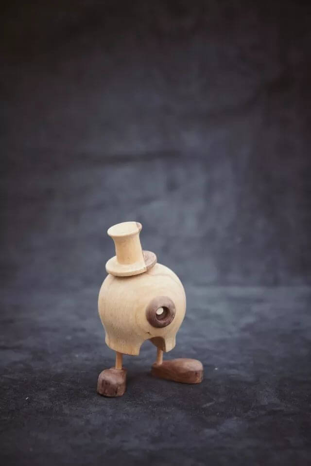
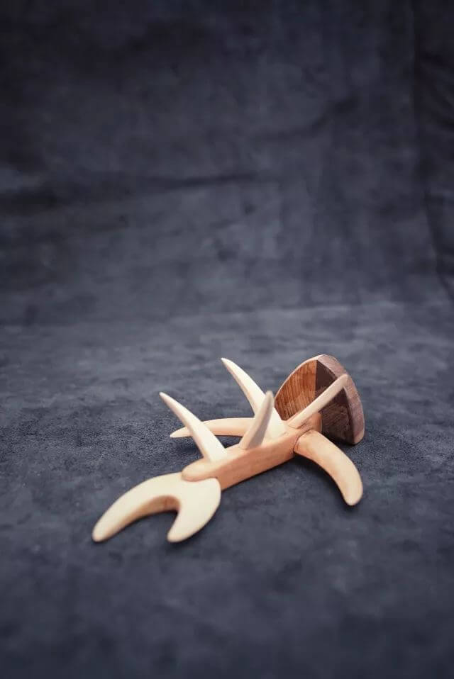
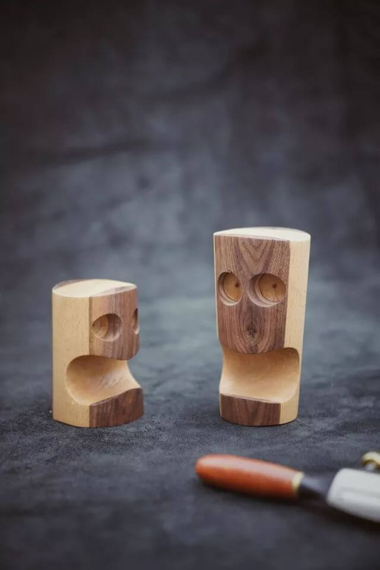
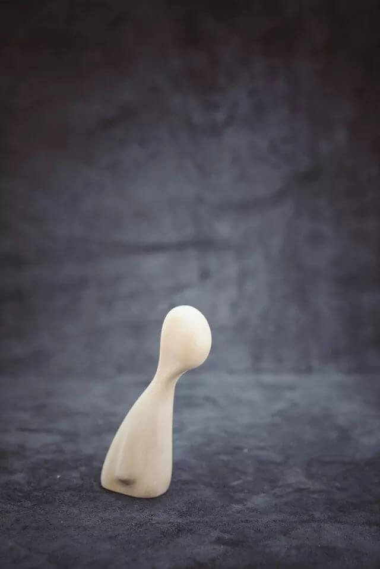
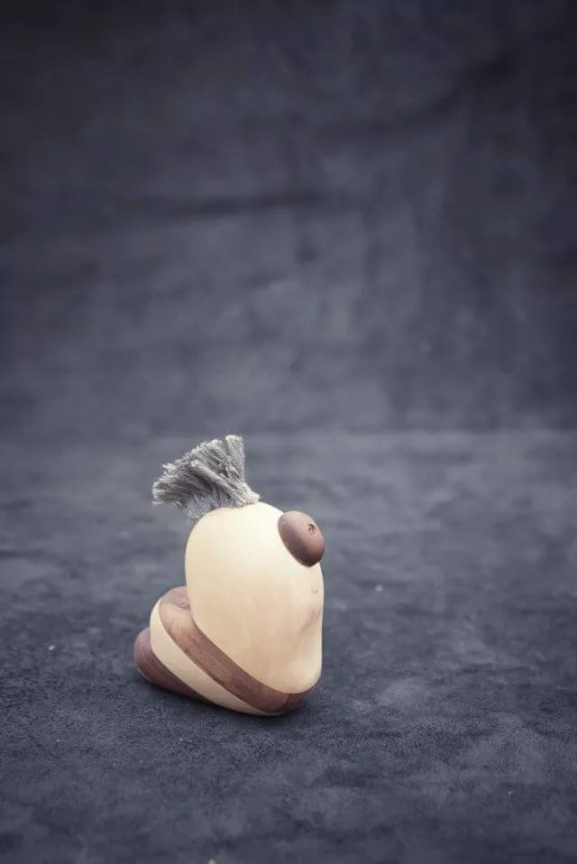
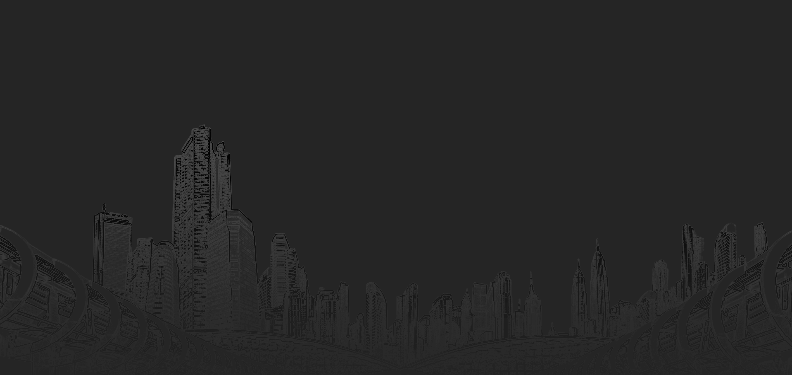

<html><head><meta http-equiv="Content-Type" content="text/html; charset=UTF-8">
		
		<meta name="keywords" content="MR.HUANG,13通信网络G5-1班,深技师,读万卷书,行万里路,积木博物馆,Bee">
		<meta name="description" content="Bee........">
		<meta name="viewport" content="width=device-width, initial-scale=1, shrink-to-fit=no">
		<title>Bee</title>
		
		<link rel="stylesheet" href="./Bee_files/bootstrap.min.css">
		<link rel="shortcut icon" type="img/x-icon" href="http://www.beestudy.win/img/planet_earth.net.ico">
		<link rel="stylesheet" type="text/css" href="./Bee_files/mr.css">
		<link rel="stylesheet" type="text/css" href="./Bee_files/iconfont.css">
		
		
		
		
	</head> 
  	
	<body>
		

			<!--头部部分-->
			

			
			<!-- 时间 -->
			
2018年1月29日  星期一  12:53:01

				<h1>MR.HUANGBLOG</h1>
				
				<!--导航部分 -->
			<ul class="nav">
				<li class="home"><a href="http://www.beestudy.win/#">首页</a></li>
				<li class="subnav_a">
				<a href="http://www.beestudy.win/#">旅行</a>
				<ul class="subnav">
				<li><a href="http://www.beestudy.win/#">九寨沟</a></li>
				<li><a href="http://www.beestudy.win/#">张家界</a><!--</li-->
				</li><li><a href="http://www.beestudy.win/#">西安</a><!--</li-->
				</li></ul>
				</li>
				<li class="subnav_a">
				<a href="http://www.beestudy.win/#">美食</a>
				<ul class="subnav">
				<li><a href="http://www.beestudy.win/#">岭南美食</a></li>
				<li><a href="http://www.beestudy.win/#">四川美食</a><!--</li-->
				</li><li><a href="http://www.beestudy.win/#">重庆美食</a><!--</li-->
				</li><li><a href="http://www.beestudy.win/#">西安美食</a><!--</li-->
				</li></ul>
				</li>
				<li class="subnav_a">
				<a href="http://www.beestudy.win/#">健身</a>
				<ul class="subnav">
				<li><a href="http://www.beestudy.win/#">胸部锻炼</a></li>
				<li><a href="http://www.beestudy.win/#">腹部锻炼</a><!--</li-->
				</li><li><a href="http://www.beestudy.win/#">肩部锻炼</a><!--</li-->
				</li></ul>
				</li>
				<li class="subnav_a">
				<a href="http://www.beestudy.win/#">知识</a>
				<ul class="subnav">
				<li><a href="http://www.beestudy.win/#">HTML基础</a></li>
				<li><a href="http://www.beestudy.win/#">CSS基础</a><!--</li-->
				</li><li><a href="http://www.beestudy.win/#">Javascript基础</a><!--</li-->
				</li></ul>
				</li>
				<li><a href="http://www.beestudy.win/#">心情</a></li>
				<li class="contact"><a href="http://www.beestudy.win/#">联系</a></li>
			</ul>
			

			<!--轮播部分 -->
			

			 <!--加载进度条-->
			

			

			<i></i>
			<i></i>
			<i></i>
			<i></i>
			<i></i>
			

			

			  <!-- 指示符 -->
			  <ul class="carousel-indicators">
			    <li data-target="#demo" data-slide-to="0" class=""></li>
			    <li data-target="#demo" data-slide-to="1" class=""></li>
			    <li data-target="#demo" data-slide-to="2" class=""></li>
			     <li data-target="#demo" data-slide-to="3" class="active"></li>
			  </ul>
			 
			  <!-- 轮播图片 -->
			  

			    

			      
			      

			        <h3>春意盎然</h3>
			        
春天总是带着一种水仙裙摆般素静淡雅的羞涩。

			      

			    

			    

			      
			      

			        <h3>炎炎夏日</h3>
			        
没有风的热情，哪有海的波涛。 

			接受风的洗礼，享受海的拥抱。

			      

			    

			    

			      
			      

			        <h3>秋意正浓</h3>
			        
小草黄了，

			        
树叶黄了，

			        
我听见风踩在树叶上沙沙地响。

			      

			    

			     

			      
			      

			        <h3>冰天雪地</h3>
			        
冬天，

			        
我愿和你雪中漫步，

			        
不为浪漫，

			        
只求一路到白头。

			      

			    

			  

			 
			  <!-- 左右切换按钮 -->
			  <a class="carousel-control-prev" href="http://www.beestudy.win/#demo" data-slide="prev">
			    
			  </a>
			  <a class="carousel-control-next" href="http://www.beestudy.win/#demo" data-slide="next">
			    
			  </a>
			 
			

				

			

				
				我最近的作品
				
			

			
			

			 	<ul class="ul_tbody">
				<li class="img_1">
				<a href="http://www.beestudy.win/#">
				
				
旅行 
				行万里路
				

			 	</a>
				</li>
				<li class="img_1">
				<a href="http://www.beestudy.win/#">
				
				
美食 
				天下美食
				

			 	</a>
				</li>
				<li class="img_1">
				<a href="http://www.beestudy.win/#">
				
				
健身 
				自强不息
				

			 	</a>
				</li>
				<li class="img_1">
				<a href="http://www.beestudy.win/#">
				
				
知识 
				
				饱读诗书
				

			 	</a>
				</li>
			 	</ul>
			 	
			

				
				<!-- 内容2 -->
				

				

				

				<h5>积木博物馆</h5>
				
看的见得,在脚下  看不见得,在心里
	
				<ul>
				<li>
				<figure>
				<a href="http://www.beestudy.win/#">
				
				<figcaption>金刚</figcaption>
				</a></figure>
				</li>
				<li>
				<figure>
				<a href="http://www.beestudy.win/#">
				
				<figcaption>牛骨系列</figcaption>
				</a></figure>
				</li>
				<li>
				<figure>
				<a href="http://www.beestudy.win/#">
				
				<figcaption>套中人</figcaption>
				</a></figure>
				</li>
				<li>
				<figure>
				<a href="http://www.beestudy.win/#">
				
				<figcaption>独眼仔</figcaption>
				</a></figure>
				</li>
				<li>
				<figure>
				<a href="http://www.beestudy.win/#">
				
				<figcaption>鱼骨</figcaption>
				</a></figure>
				</li>
				<li>
				<figure>
				<a href="http://www.beestudy.win/#">
				
				<figcaption>惊讶系列</figcaption>
				</a></figure>
				</li>
				<li>
				<figure>
				<a href="http://www.beestudy.win/#">
				
				<figcaption>孤独症</figcaption>
				</a></figure>
				</li>
				<li>
				<figure>
				<a href="http://www.beestudy.win/#">
				
				<figcaption>毛虫</figcaption>
				</a></figure>
				</li>
				</ul>
				

			

			   <h3>联系我们</h3>
			

			    

			<form name="regsiter" class="contentform" action="http://www.beestudy.win/">
			<input type="text" name="text" class="text_rgt" placeholder="Full-Name" required="required"> 
			<input type="email" name="text" class="email_rgt" placeholder="Email" required="required">
			<textarea class="form_textarea" placeholder="Message" required="required" name="summary"></textarea> 
			
<a href="http://www.beestudy.win/#">提交</a>

			

			
			

			</form>	

			    

			

			

			
			

				<ul>
					<li class="bootm_nav">
					<a href="http://www.beestudy.win/">http://www.beestudy.win</a>
					</li>
					<li class="bootm_right"><a href="http://www.beestudy.win/#">Home</a></li>
					<li class="bootm_right"><a href="http://www.beestudy.win/#">Travel</a></li>
					<li class="bootm_right"><a href="http://www.beestudy.win/#">Food</a></li>
					<li class="bootm_right"><a href="http://www.beestudy.win/#">Fitness</a></li>
					<li class="bootm_right"><a href="http://www.beestudy.win/#">Knowledge</a></li>
					<li class="bootm_right"><a href="http://www.beestudy.win/#">Mood</a></li>
					<li class="bootm_right"><a href="http://www.beestudy.win/#">Contact</a></li>
			   </ul>
			

				<!--回到顶部-->
				 

				 <a href="javascript:scroll(0,0)">
				<i class="iconfont"></i>
				</a>
				 

 

		
	

</body></html>
